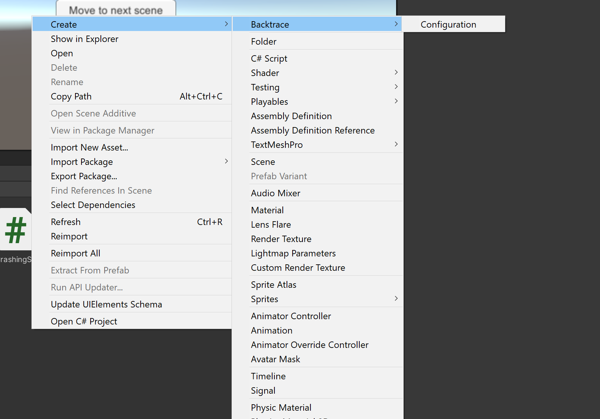
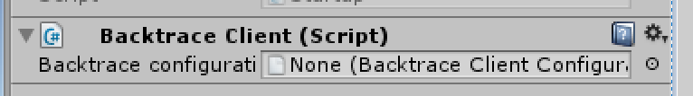
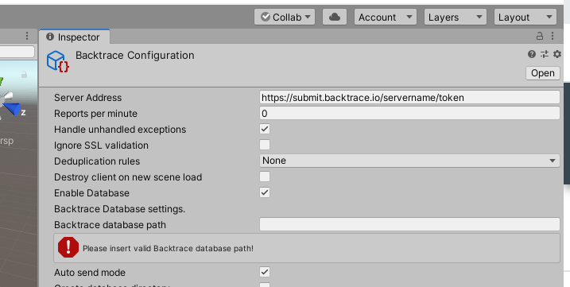
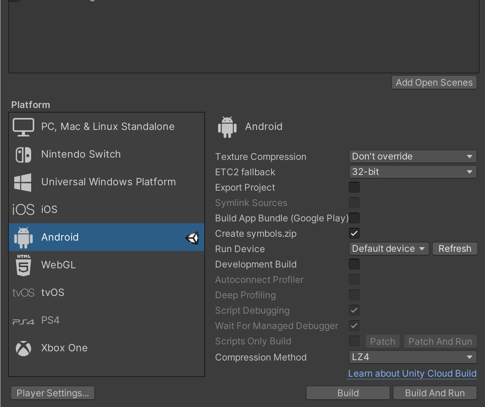
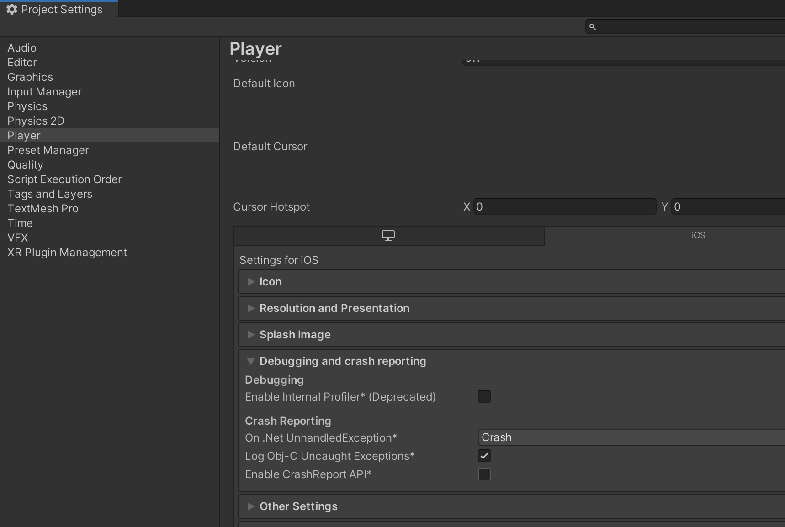
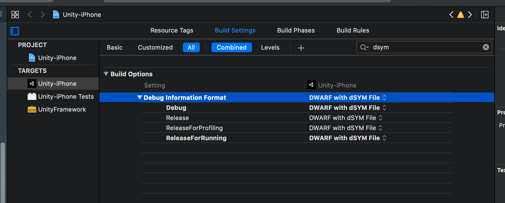
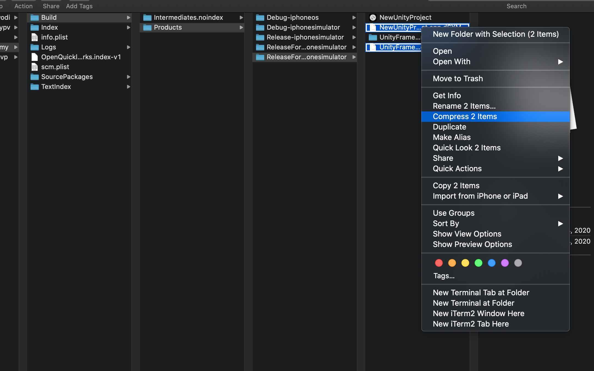
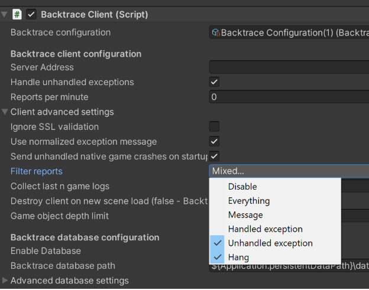
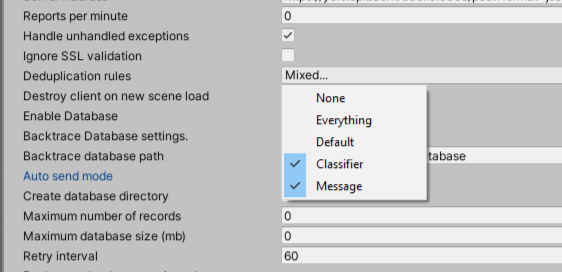

# Backtrace Unity support

[Backtrace](http://backtrace.io/)'s integration with Unity allows developers to capture and report log errors, handled and unhandled Unity exceptions, and native crashes to their Backtrace instance, instantly offering the ability to prioritize and debug software errors.

Create your Backtrace instance at https://backtrace.io/create-unity today and then integrate this library into your game.

[](https://openupm.com/packages/io.backtrace.unity/)

[github release]: (https://github.com/backtrace-labs/backtrace-labs/)

- [Features Summary](#features-summary)
- [Prerequisites](#prerequisites)
- [Platforms Supported](#platforms-supported)
- [Setup](#installation)
- [Plugin Best Practices](#plugin-best-practices)
- [Android Specific information](#android-specific-information)
- [iOS Specific information](#ios-specific-information)
- [Data Privacy](#data-privacy)
- [API Overview](#api-overview)
- [Breadcrumbs](#breadcrumbs)
- [Crash Free Metrics](#crash-free-metrics)
- [Architecture description](#architecture-description)
- [Investigating an Error in Backtrace](#investigating-an-error-in-backtrace)

## Usage

```csharp

 //Read from manager BacktraceClient instance
var backtraceClient = GameObject.Find("_Manager").GetComponent<BacktraceClient>();
try
{
    //throw exception here
}
catch(Exception exception)
{
    var report = new BacktraceReport(exception);
    backtraceClient.Send(report);
}
```

# Feature Summary <a name="features-summary"></a>

- Lightweight library that quickly submits log errors, handled and unhandled exceptions, and native crashes to Backtrace
  - Supports wide range of Unity versions (2017.4+) and deployments (iOS, Android, Windows, Mac, WebGL, PS4/5 Xbox One/S/X, Nintendo Switch, Stadia)
  - Install via [OpenUPM](https://openupm.com/packages/io.backtrace.unity/) and the Unity Package Manager
- Collect detailed context
  - Callstacks, including function names and line numbers where possible
  - System metadata including device GUID, OS version, memory usage, process age
  - Custom metadata including app version, scene info, device drivers
  - Breadcrumbs, screenshots, log or config files, other attachments
  - Android NDK Crashes; iOS Native Crashes, Windows Native Crashes
- Client-side features
  - Deduplication options and custom client side fingerprinting
  - Client side filters and sampling controls
  - Offline crash capture/storage for future collection
  - Customizable event handlers and base classes
  - Performance statistics collection option for timing observability
- Unity IDE integration to configure Backtrace behaviors in your game.

# Prerequisites

- Unity environment 2017.4.x
- .NET 3.5/4.5/Standard 2.0 scripting runtime version
- Mono or IL2CPP scripting backend
- Backtrace instance - Create your own at https://backtrace.io/create-unity

# Platforms Supported

Backtrace-unity has been tested and certified for games deployed on the following platforms:
- Mobile - Android, iOS
- PC - Windows, Mac
- Web - WebGL
- Game Consoles - PlayStation4, Xbox One, Nintendo Switch

There are some differences in capabilities that backtrace-unity provides based on the platform. Major capabilities are summarized as follows:

- All Platforms - Errors, Unhandled Exceptions, Handled Exceptions, Custom Indexable Metadata, File Attachments*, Breadcrumbs, Automatic attachment of Screenshots, Client Side Deduplication Rules*, Client Side Submission Filtering, Client Side Submission Limits, Crash Free Metrics (except WebGL), Performance Diagnostics, Offline Database\*(Except Nintendo Switch)
- Android -Identified by attribute `uname.sysname` = Android; ANRs (Hangs), Native Process and Memory Information, Java Exception Handler (Plugins, Exported Game in Android Studio), NDK crashes, low memory warnings.
- iOS - Identified by attribute `uname.sysname` = IOS; ANRs (Hangs), Native Engine, Memory and Plugin Crashes.
- WebGL - Identified by attribute `uname.sysname` = WebGL. The attribute `device.model` is currently used to share the browser information. Note that stacktraces for WebGL errors are only available if you choose to enable them in the Publishing Settings / Enable Exceptions drop down. More details [here](https://docs.unity3d.com/Manual/webgl-building.html).
- Switch - Identified by attribute `uname.sysname` = Switch. Note that the attribute GUID is regenerated with each Switch restart (It is not an accurate count of number of Users or Devices. It is a count of Switch Sessions). Note that the current release does no support Offline Database or related features.
- PlayStation4 - Identified by attribute `uname.sysname` = PS4.
- Windows - Identified by attribute `uname.sysname` = Windows. Provides an option to capture Minidumps for Engine Crashes.
- MacOS - Identified by attribute `uname.sysname` = MacOS.

Note: Unity allows you to disable stack trace information in player properties. If this is set, the call stack will be empty and no log lines section will be included in Breadcrumbs.

# Setup <a name="installation"></a>

List of steps necessary to setup full Backtrace Unity integration.

## Installation guide

You have three options, we recommend using OpenUPM for most users.

### OpenUPM

- See [our package](https://openupm.com/packages/io.backtrace.unity/) and installation instructions on OpenUPM.

### Git Url

Since Unity 2018.3 the Unity Package Manager allows you to install a package directly via [Git](https://docs.unity3d.com/Manual/upm-ui-giturl.html). You can use the clone URL on the main page of our repository.

### Manual download

- Download the backtrace-unity zip file. Unzip it and keep the folder in a known location. It can be downloaded [here](https://github.com/backtrace-labs/backtrace-unity/releases)
- Open your Unity project
- Use the Unity Package Manager to install the backtrace-unity library (Window -> Package Manager -> Add Package From Disk -> `KnownFolder/package.json`)

## Integrating into your project

- Under the Assets Menu "Create" option, there is now a Backtrace -> Configuration option. Choose that option (or Right click on empty space and select from the menu box) to have a Backtrace Configuration is generated in the Assets folder. You can drag and drop generated asset file into Backtrace Client configuration window.
  
- Next, select an object from the Scene Hierarchy to associate the Backtrace reporting client to. In the example below, we use the Manager object., Using the Inspector panel, click the Add Component button and search for the Backtrace Client object.
- Within the Backtrace Client panel, there is a Backtrace Configuration field. Drag and drop the Backtrace Configuration from the Assets folder to that field. More fields will appear for you to fill in to configure the Backtrace Client and Offline Database options.
  
- Provide valid Backtrace client configuration and start using library!
  

## Integrating into your project via code

One of the integration paths require to create game object in your game scene. If you would like to initialize Backtrace integration programatically, we recommend to use `Initialize` method available in `BacktraceClient` class.

```csharp
  var backtraceClient = BacktraceClient.Initialize(
      url: serverUrl,
      databasePath: "${Application.persistentDataPath}/sample/backtrace/path",
      gameObjectName: "game-object-name",
      attributes: attributes);
```

If you need to use more advanced configuration, `Initialize` method accepts a `BacktraceConfiguration` scriptable object.

```csharp
  var configuration = ScriptableObject.CreateInstance<BacktraceConfiguration>();
  configuration.ServerUrl = serverUrl;
  configuration.Enabled = true;
  configuration.DatabasePath = "${Application.persistentDataPath}/sample/backtrace/path";
  configuration.CreateDatabase = true;
  configuration.Sampling = 0.002;
  _backtraceClient = BacktraceClient.Initialize(
      configuration,
      gameObjectName: "game-object-name",
      attributes: attributes);
```

# Plugin best practices

The plugin will report on 6 'classes' or errors:

1. Log Errors - Programmers use [Debug.LogError](https://docs.unity3d.com/ScriptReference/Debug.LogError.html), a variant of Debug.Log, to log error messages to the console.
2. Unhandled Exceptions - Unhandled Exceptions are exceptions in a game that occur outside of an explicit try / catch statement.
3. Handled Exceptions - Exceptions that are explicitly caught and handled.
4. Crashes - An end to the game play experience. The game crashes or restarts.
5. Hangs (mobile only) - A game is non responsive. Some platforms will tell the user “This app has stopped responding
6. Out of memory crashes (mobile only) - A game crashed under memory pressure.
7. Message reports, explictly sent by the BacktraceClient.

The plugin provides 3 controls for managing what the client will report.

- The Filter Reports option in the UI, where you can select Everything, Message, Handled Exception, Unhandled Exception, Hang and Game Error.
- [SkipReports](#filtering-a-report) allows you to tell the client to only report on specific classes of these errors.
- [Log Error Sampling](#sampling-log-errors) allows you to tell the client to sample the DebugLog errors. Programmers may not be aware of the frequency that DebugLog errors are being generated when released in retail, and we recommend you are intentional about capturing these types of errors.
- [Client Side Deduplication](#client-side-deduplication) allows you to aggregate the reports based on callstack, error message, or classifier, and send only a single message to Backtrace each time the offline database is flushed.

## Backtrace Client and Offline Database Settings

The following is a reference guide to the Backtrace Client fields:

- Server Address: This field is required to submit exceptions from your Unity project to your Backtrace instance. More information about how to retrieve this value for your instance is our docs at What is a submission URL and What is a submission token? NOTE: the backtrace-unity plugin will expect full URL with token to your Backtrace instance,
- Reports per minute: Limits the number of reports the client will send per minutes. If set to 0, there is no limit. If set to a higher value and the value is reached, the client will not send any reports until the next minute. Further, the BacktraceClient.Send/BacktraceClient.SendAsync method will return false.
- Client Advanced Settings
  - Destroy client on new scene load - Backtrace-client by default will be available on each scene. Once you initialize Backtrace integration, you can fetch Backtrace game object from every scene. In case if you don't want to have Backtrace-unity integration available by default in each scene, please set this value to true.
  - Use normalized exception message: If exception does not have a stack trace, use a normalized exception message to generate fingerprint.
  - Filter reports: Configure Backtrace plugin to filter reports based on report type - Message, Exception, Unhandled Exception, Hang. By default this option is disabled (None).
  - Send unhandled native game crashes on startup: Try to find game native crashes and send them on Game startup.
  - Handle unhandled exceptions: Toggle this on or off to set the library to handle unhandled exceptions that are not captured by try-catch blocks.
  - Symbols upload token - If you want to upload Unity debug symbols for Android NDK Native Crash debugging, enter your Backtrace Symbol upload token here. This option is available only in Android build.
  - Log random sampling rate - Enables a random sampling mechanism for DebugLog.error messages - **by default** sampling is equal to **0.01** - which means only **1%** of randomply sampling **reports will be send** to Backtrace. If you would like to send all DebugLog.error messages to Backtrace - please replace 0.01 value with 1.
 - Game Object Depth Limit: Allows developer to filter number of game object childrens in Backtrace report.
 - REMOVED: Collect last n game logs: Collect last n number of logs generated by game. This is not part of Breadcrumbs
 - Enabled performance statistics: Allows `BacktraceClient` to measure execution time and include performance information as report attributes.
 - Ignore SSL validation: Unity by default will validate ssl certificates. By using this option you can avoid ssl certificates validation. However, if you don't need to ignore ssl validation, please set this option to false.
 - Handle ANR (Application not responding) - this option is available in Android and iOS build only. It allows to catch and report on ANR (application not responding) events happening in your game on mobile platform. See [here](#anr-reporting) for details.
 - Send out of memory exceptions to Backtrace - this option is available in Android and iOS build only. See [here](#oom-reporting) for details.

- Crash Free Metrics Reporting
  - Enable crash free metrics reporting. This toggles the periodic (default: every 30 minutes) transmission of session information to the Backtrace endpoints. This will enable metrics such as crash free users and crash free sessions.
- Attachments Paths
  - Paths to attachments to be included for all report types.
- Backtrace Database Configuration
  - Enable Database: When this setting is toggled, the backtrace-unity plugin will configure an offline database that will store reports if they can't be submitted do to being offline or not finding a network. When toggled on, there are a number of Database settings to configure.
  - Backtrace Database path: This is the path to directory where the Backtrace database will store reports on your game. You can use interpolated strings SUCH AS
    `${Application.persistentDataPath}/backtrace/database` to dynamically look up a known directory structure to use. NOTE: Backtrace database will remove all existing files in the database directory upion first initialization.
  - Create database directory toggle: If toggled, the library will create the offline database directory if the provided path doesn't exists,
  - Client-side deduplication: Backtrace-unity plugin allows you to combine the same reports. By using deduplication rules, you can tell backtrace-unity plugin how we should merge reports.
  - Breadcrumbs
    - Enable breadcrumbs support - Toggles whether or not Breadcrumbs will be collected and submitted
    - Breadcrumbs events type - Specifies which events to collect and send
    - Breadcrumbs log level - Specifies which logs levels to include. For example, including DEBUG log level will provide more details, but a shorter time window due to network bandwidth constraints
  - Capture native crashes: This option will appear for games being deployed to Android or iOS and will allow Backtrace to capture and symbolicate native stack traces from crashes impacting the Unity Engine or any Unity Plugin.
  - Minidump type: Type of minidump that will be attached to Backtrace report in the report generated on Windows machine.
  - Attach Unity Player.log: Add Unity player log file to Backtrace report. NOTE: This feature is available only on desktop - Windows/MacOS/Linux.
  - Attach screenshot: Generate and attach screenshot of frame as exception occurs.
  - Auto Send Mode: When toggled on, the database will send automatically reports to Backtrace server based on the Retry Settings below. When toggled off, the developer will need to use the Flush method to attempt to send and clear. Recommend that this is toggled on.
  - Maximum number of records: This is one of two limits you can impose for controlling the growth of the offline store. This setting is the maximum number of stored reports in database. If value is equal to zero, then limit not exists, When the limit is reached, the database will remove the oldest entries.
  - Maximum database size: This is the second limit you can impose for controlling the growth of the offline store. This setting is the maximum database size in MB. If value is equal to zero, then size is unlimited, When the limit is reached, the database will remove the oldest entries.
  - Retry interval: If the database is unable to send its record, this setting specifies how many seconds the library should wait between retries.
  - Maximum retries: If the database is unable to send its record, this setting specifies the maximum number of retries before the system gives up.
  - Retry order: This specifies in which order records are sent to the Backtrace server.

# Android Specific information

The backtrace-unity library includes support for capturing Android NDK crashes and additional Android Native information, from underlying Android OS (Memory and process related), JNI, and NDK layers.

## Native process and memory related information

`system.memory` usage related information including memfree, swapfree, and vmalloc.used is now available. Additional VM details and voluntary / nonvountary ctxt switches are included.

## ANRs and Hangs <a name="anr-reporting"></a>

When configuring the backtrace-unity client for an Android deployment, programmers will have a toggle available in the backtrace-unity GUI in the Unity Editor to enable or disable ANR or Hang reports. This will use the default of 5 seconds. This will be made configurable in a future release.

The `error.type` for these reports will be `Hang`.

## Out of Memory Reports <a name="oom-reporting"></a>

Backtrace can detect and flag low memory conditions for Unity games running on Android devices. When low memory conditions are detected, two attributes will be set:

- `memory.warning` will be set to `true`
- `memory.warning.date` will be set to the epoch timestamp of when the low memory condition was detected.

If the games does not recover from low memory conditions and the operating system does decide to kill the game, a crash report will be submitted to Backtrace with `memory.warning` and `memory.warning.date` set.

This functionality can be toggled on or off in the Backtrace configuration.

## Symbols upload

Unity allows developer to generate symbols archive called `symbols.zip` in the il2cpp build pipeline in the root directory of your game. In this archive you can find generated symbols for your game libraries. When your game crashes due to a native exception, your stack trace will contain only memory addresses instead of function name. Symbols from `symbols.zip` archive allows Backtrace to match function address to function name in your source code.

To generate `symbols.zip` archive make sure:

- you selected il2cpp build,
- you checked `Create symbols.zip` in the Build settings window
  

Backtrace offers to upload symbols automatically from Unity Editor to your Backtrace instance. Backtrace symbols upload pipeline will be triggered after successfull build of il2cpp Android game and when Symbols upload token is available in Backtrace Client options. After successfull build, upload pipeline will confirm symbols upload.

If you build outside the Unity Editor and need to manually upload symbols to Backtrace, you must rename symbols generated by Unity end simply with a `.so` extension. By default, symbol files within the .zip will end with extension `.sym.so`. or `.dbg.so` Backtrace will only match symbols to files based on the ending with `.so` extension. Please ensure all files have a single `.so` extention before uploading the zip.

To learn more about how to submit those symbol files to Backtrace, please see the Project Settings / Symbols. You can manage submission tokens, upload via the UI, or configure external Symbol Servers to connect and discover required symbols. Please review additional documentation [here](https://support.backtrace.io/hc/en-us/articles/360040517071-Symbolication-Overview).

# iOS Specific information

The backtrace-unity library includes support for capturing native iOS crashes as well as iOS native memory and process information from underlying iOS layer.

## Native process and memory related information

system and vm usage related information including system.memory.free, system.memory.used, system.memory.total, system.memory.active, system.memory.inactive, system.memory.wired are avaialble.

## Hangs

When configuring the backtrace-unity client for an iOS deployment, programmers will have a toggle available in the backtrace-unity GUI in the Unity Editor to enable or disable ANR or Hang reports. This will use the default of 5 seconds. The `error.type` for these reports will be `Hang`.

## Out of Memory Reports

On iOS devices, when the operation system indicates there's memory pressure, Backtrace take a snapshot of the application state and persists it on the mobile device. When the operating system ends up killing the game, upon restart Backtrace will inspect the state file and deduce if the game was terminated because of memory pressure (for more information on the algorithm, see the [backtrace-cocoa repository](https://github.com/backtrace-labs/backtrace-cocoa#how-does-your-out-of-memory-detection-algorithm-work-)). If so, an error will be sent based on the data that was previously collected and persisted. Note that a snapshot will be taken every 2 minutes at most if low memory conditions persist.

This functionality can be toggled on or off in the Backtrace configuration.

## Native Crashes

When configuring the backtrace-unity client for an iOS deployment in the Unity Editor, programmers will have a toggle to enable or disable `Capture native crashes`. If this is enabled, the backtrace-unity client will ensure the crash report is generated, stored locally, and uploaded upon next game start. Unity crash reporter might prevent Backtrace Crash reporter from sending crashes to Backtrace. To be sure Backtrace is able to collect and send data please set "Enable CrashReport API" to false.


## Debug Symbol upload

When building your iOS game in Xcode, you must make sure you configure the build settings to generate "`DWARF with dSYM files` for any build that you want to debug with Backtrace (By default, it may only generate `DWARF`). In the example below, `DWARF with dSYM files` is enabled in the `Project Build Settings` for each `Target`.


This change will generate dSYM files every time you build your game in Xcode. You can find the files in the `...\Build\Products\<the folder representing your build>`. Within there will be dSYM files that you should compress into a .zip file and submit to Backtrace for use during symbolication.



To learn more about how to submit those symbol files to Backtrace, please see the Project Settings / Symbols. You can manage submission tokens, upload via the UI, or configure external Symbol Servers to connect and discover required symbols. Please review additional Symbol documentaion at https://support.backtrace.io/hc/en-us/articles/360040517071-Symbolication-Overview

# Data Privacy

Backtrace-Unity allows developers to remove and modify data that the library collects when an exception occurs using the following methods:

- BeforeSend event
  The library will fire an event every time an exception in the managed environment occurs. The BeforeEvent trigger allows you to skip the report (you can do that by returning null value) or to modify data that library collected before sending the report. BeforeSend event might be useful in case if you would like to extend attributes or json object data based on data that application has at the time of exception.

Example code:

```csharp
//Read from manager BacktraceClient instance
var backtraceClient = GameObject.Find("manager name").GetComponent<BacktraceClient>();
// set beforeSend event
_backtraceClient.BeforeSend = (BacktraceData data) =>
{
    data.Attributes.Attributes["my-dynamic-attribute"] = "value";
    return data;
};
```

- Environment Variable Management
  The `Annotations` class exposes the EnvironmentVariableCache dictionary - a dictionary that stores environment variables collected by the library. You can manipulate the data in this cache before the report is sent. For example - to replace the`USERNAME` environment variable collected by Backtrace library with random string you can easily edit annotations environment varaible and Backtrace-Untiy will reuse them on report creation.

```csharp
Annotations.EnvironmentVariablesCache["USERNAME"] = "%USERNAME%";
```

Also you can still use BeforeSend event to edit collected diagnostic data:

```csharp
  client.BeforeSend = (BacktraceData data) =>
  {
      data.Annotation.EnvironmentVariables["USERNAME"] = "%USERNAME%";
      return data;
  }
```

# API Overview

You can further configure your game to submit crashes by making further changes in the C# code for your game.

## Basic configuration

If you setup `Backtrace client` and `Backtrace database` configuration you can retrieve database and client instances by using `GameObject`. When you retrieve client instance you can start sending reports from try/catch block in your game!

```csharp

 //Read from manager BacktraceClient instance
var backtraceClient = GameObject.Find("manager name").GetComponent<BacktraceClient>();

//Set custom client attribute
backtraceClient["attribute"] = "attribute value";

 //Read from manager BacktraceClient instance
var database = GameObject.Find("manager name").GetComponent<BacktraceDatabase>();


try{
    //throw exception here
}
catch(Exception exception){
    var report = new BacktraceReport(exception);
    backtraceClient.Send(report);
}
```

If you would like to change Backtrace client/database options, we recommend to change these values on the Unity UI via Backtrace Configuration file. However, if you would like to change these values dynamically, please use method `Refresh` to apply new configuration changes.

For example:

```csharp
//Read from manager BacktraceClient instance
var backtraceClient = GameObject.Find("manager name").GetComponent<BacktraceClient>();
//Set custom client attribute
backtraceClient["attribute"] = "attribute value";
//Change configuration value
backtraceClient.Configuration.DeduplicationStrategy = deduplicationStrategy;
//Refresh configuraiton
backtraceClient.Refresh();

```

## Sending an error report <a name="documentation-sending-report"></a>

`BacktraceClient.Send` method will send an error report to the Backtrace endpoint specified. There `Send` method is overloaded, see examples below:

### Using BacktraceReport

The `BacktraceReport` class represents a single error report. (Optional) You can also submit custom attributes using the `attributes` parameter, or attach files by supplying an array of file paths in the `attachmentPaths` parameter.

```csharp
try
{
  //throw exception here
}
catch (Exception exception)
{
    var report = new BacktraceReport(
        exception: exception,
        attributes: new Dictionary<string, string>() { { "key", "value" } },
        attachmentPaths: new List<string>() { @"file_path_1", @"file_path_2" }
    );
    backtraceClient.Send(report);
}
```

Notes:

- if you setup `BacktraceClient` with `BacktraceDatabase` and your application is offline or you pass invalid credentials to `Backtrace server`, reports will be stored in database directory path,
- `BacktraceReport` allows you to change default Fingerprint generation algorithm. You can use `Fingerprint` property if you want to change Fingerprint value. Keep in mind - Fingerprint should be valid sha256 string. By setting `Fingerprint` you are instructing the client reporting library to only write a single report for the exception as it is encountered, and maintain a counter for every additional time it is encountered, instead of creating a new report. This will allow better control over the volume of reports being generated and sent to Backtrace. The counter is reset when the offline database is cleared (usually when the reports are sent to the server). A new single report will be created the next time the error is encountered.
- `BacktraceReport` allows you to change grouping strategy in Backtrace server. If you want to change how algorithm group your reports in Backtrace server please override `Factor` property.

If you want to use `Fingerprint` and `Factor` property you have to override default property values. See example below to check how to use these properties:

```csharp
try
{
  //throw exception here
}
catch (Exception exception)
{
    var report = new BacktraceReport(...){
        Fingerprint = "sha256 string",
        Factor = exception.GetType().Name
    };
    ....
}

```

## Attaching custom event handlers <a name="documentation-events"></a>

`BacktraceClient` allows you to attach your custom event handlers. For example, you can trigger actions before the `Send` method:

```csharp

 //Add your own handler to client API

backtraceClient.BeforeSend =
    (Model.BacktraceData model) =>
    {
        var data = model;
        //do something with data for example:
        data.Attributes.Attributes.Add("eventAttribute", "EventAttributeValue");
        if(data.Classifier == null || !data.Classifier.Any())
        {
            data.Attachments.Add("path to attachment");
        }

        return data;
    };
```

`BacktraceClient` currently supports the following events:

- `BeforeSend`
- `OnClientReportLimitReached`
- `OnServerResponse`
- `OnServerError`

## Reporting unhandled application exceptions

`BacktraceClient` supports reporting of unhandled application exceptions not captured by your try-catch blocks. To enable reporting of unhandled exceptions please use Backtrace configuration UI available in the Unity IDE.

## Breadcrumbs <a name="breadcrumbs"></a>

Once enabled, various "breadcrumb" events (such as application going to background, logging message, network connectivity lost and many more) will be submitted with all types of Backtrace reports and viewable in the web console. It is possible to configure client-side which events to include and from which log level severity. By default the breadcrumbs are limited to 64kB and older events will automatically be cleaned up. This functionality is supported on all Unity supported platforms.

The Breadcrumbs will show up under the Breadcrumbs tab in the web console:


It is also possible to add custom events, like "player completed a level" as well as sub attributes, via the API:

```cs
GetComponent<BacktraceClient>().Breadcrumbs.Info("Player Base Upgraded", new Dictionary<string, string>() {
  {"base.name", "MtGox"},
  {"base.level", "15"}
});
```

## Crash Free Metrics <a name="crash-free-metrics"></a>

Once enabled, unique application launches and unique player identifiers (default: guid) will be submitted to Backtrace so you will be able to get an overview in our web console of how many errors, hangs, crashes and memory problems occur compared to all active users for a given platform, version, and more. 


Note! This functionality is supported on all Unity supported platforms **except WebGL**.

## Filtering a report

Report filtering is enabled by using the `Filter reports` option in the user interface or for more advanced use-cases, the `SkipReport` delegate available in the BacktraceClient.

Sample code:

```csharp
  // Return true to ignore a report, return false to handle the report
  // and generate one for the error.
  BacktraceClient.SkipReport = (ReportFilterType type, Exception e, string msg) =>
  {
    // ReportFilterType is one of None, Message, Exception,
    // UnhandledException or Hang. It is also possible to
    // to filter based on the exception and exception message.

    // Report hangs and crashes only.
    return type != ReportFilterType.Hang && type != ReportFilterType.UnhandledException;
  };
```

For example, to only get error reporting for hangs or crashes then only return false for Hang or UnhandledException or set the corresponding options in the user interface as shown below.


## Sampling Log Errors

`BacktraceClient` allows a configuration setting for log error sampling rate, which enables a random sampling mechanism for the errors captured via the DebugLog.error call. By default this sampling is equal to 0.01 - which means 1 of randomly sampled DebugLog Error Reports will be sent to Backtrace. This is a measure to prevent users from inadvertantly collecting hundreds of thousands of error messages from released games that they may not intend to. If you would like to send all DebugLog.error messages to Backtrace - please replace 0.01 value with 1.

## Flush database

When your application starts, database can send stored offline reports. If you want to do make it manually you can use `Flush` method that allows you to send report to server and then remove it from hard drive. If `Send` method fails, database will no longer store data.

```csharp
backtraceDatabase.Flush();
```

## Send database

This method will try to send all objects from the database respecting the client side deduplication and retry setting. This can be used as an alternative to the `Flush` method which will try to send all objects from the database ignoring any client side deduplication and retry settings.

```csharp
backtraceDatabase.Send();
```

## Clearing database

You can clear all data from database without sending it to server by using `Clear` method. `BacktraceDatabase` will remove all files and won't send it to server.

```csharp
backtraceDatabase.Clear();
```

## Client side Deduplication

Backtrace unity integration allows you to aggregate the same reports and send only one message to Backtrace Api. As a developer you can choose deduplication options. Please use `DeduplicationStrategy` enum to setup possible deduplication rules in Unity UI:


Deduplication strategy types:

- Ignore - ignore deduplication strategy
- Default - deduplication strategy will use current strack trace to find duplicated reports
- Classifier - deduplication strategy will use stack trace and exception type to find duplicated reports
- Message - deduplication strategy will use stack trace and exception message to find duplicated reports

Notes:

- When you aggregate reports via Backtrace C# library, `BacktraceDatabase` will increase number of reports in BacktraceDatabaseRecord counter property.
- Deduplication algorithm will include `BacktraceReport` `Fingerprint` and `Factor` properties. `Fingerprint` property will overwrite deduplication algorithm result. `Factor` property will change hash generated by deduplication algorithm.
- If Backtrace unity integration combine multiple reports and user will close a game before plugin will send data to Backtrace, you will lose coutner information.
- `BacktraceDatabase` methods allows you to use aggregated diagnostic data together. You can check `Hash` property of `BacktraceDatabaseRecord` to check generated hash for diagnostic data and `Counter` to check how much the same records we detect.
- `BacktraceDatabase` `Count` method will return number of all records stored in database (included deduplicated records),
- `BacktarceDatabase` `Delete` method will remove record (with multiple deduplicated records) at the same time.

# Architecture description

## BacktraceReport <a name="architecture-BacktraceReport"></a>

**`BacktraceReport`** is a class that describe a single error report.

## BacktraceClient <a name="architecture-BacktraceClient"></a>

**`BacktraceClient`** is a class that allows you to send `BacktraceReport` to `Backtrace` server by using `BacktraceApi`. This class sets up connection to the Backtrace endpoint and manages error reporting behavior (for example, saving minidump files on your local hard drive and limiting the number of error reports per minute). `BacktraceClient` inherits from `Mono behavior`.

`BacktraceClient` requires from a `Backtrace configuration window`

- `Sever URL` - URL to `Backtrace` server,
- `Token` - token to `Backtrace` project,
- `ReportPerMin` - A cap on the number of reports that can be sent per minute. If `ReportPerMin` is equal to zero then there is no cap.
- `HandleUnhandledExceptions` - flag that allows `BacktraceClient` handling unhandled exception by default.

## BacktraceData <a name="architecture-BacktraceData"></a>

**`BacktraceData`** is a serializable class that holds the data to create a diagnostic JSON to be sent to the Backtrace endpoint via `BacktraceApi`. You can add additional pre-processors for `BacktraceData` by attaching an event handler to the `BacktraceClient.BeforeSend` event. `BacktraceData` require `BacktraceReport` and `BacktraceClient` client attributes.

## BacktraceApi <a name="architecture-BacktraceApi"></a>

**`BacktraceApi`** is a class that sends diagnostic JSON to the Backtrace endpoint. `BacktraceApi` is instantiated when the `BacktraceClient` awake method is called. `BacktraceApi` can asynchronous reports to the Backtrace endpoint.

## BacktraceDatabase <a name="architecture-BacktraceDatabase"></a>

**`BacktraceDatabase`** is a class that stores error report data in your local hard drive. `BacktraceDatabase` stores error reports that were not sent successfully due to network outage or server unavailability. `BacktraceDatabase` periodically tries to resend reports
cached in the database. In `BacktraceDatabaseSettings` you can set the maximum number of entries (`Maximum retries`) to be stored in the database. The database will retry sending
stored reports every `Retry interval` seconds up to `Retry limit` times, both customizable in the `Backtrace database configuration`.

`Backtrace database` has the following properties:

- `Database path` - the local directory path where `BacktraceDatabase` stores error report data when reports fail to send,
- `MaxRecordCount` - Maximum number of stored reports in Database. If value is equal to `0`, then there is no limit.
- `MaxDatabaseSize` - Maximum database size in MB. If value is equal to `0`, there is no limit.
- `AutoSendMode` - if the value is `true`, `BacktraceDatabase` will automatically try to resend stored reports. Default is `false`.
- `RetryBehavior` - - `RetryBehavior.ByInterval` - Default. `BacktraceDatabase` will try to resend the reports every time interval specified by `RetryInterval`. - `RetryBehavior.NoRetry` - Will not attempt to resend reports
- `RetryInterval` - the time interval between retries, in seconds.
- `RetryLimit` - the maximum number of times `BacktraceDatabase` will attempt to resend error report before removing it from the database.

If you want to clear your database or remove all reports after send method you can use `Clear` and `Flush`.

## ReportWatcher <a name="architecture-ReportWatcher"></a>

**`ReportWatcher`** is a class that validate send requests to the Backtrace endpoint. If `reportPerMin` is set in the `BacktraceClient` constructor call, `ReportWatcher` will drop error reports that go over the limit. `BacktraceClient` check rate limit before `BacktraceApi` generate diagnostic json.

# Investigating an Error in Backtrace

Once errors are being reported to your Backtrace instance, you should see them in your Triage and Web Debugger view. See below for a screenshot of the Triage view with some Unity exceptions reported.


The developer who is debugging the error may find it useful to view more details of Exception. They choose the 'View Latest Trace' action to see more details in the Backtrace Web Debugger. Below we can see a list of all attributes submitted with a report. (Note the yield signs are just an indicator that this value is not indexed in Backtrace). We can also see the call stack and details of the selected frame.


Below we see more details above the Environment Variables from the Web Debugger to further assist with investigation.

